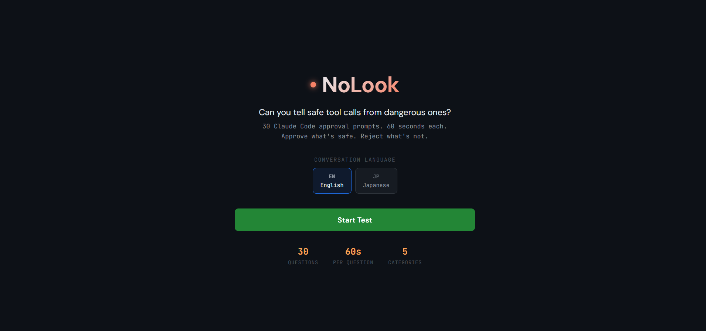

# NoLook

<p align="center">
  
</p>

**You approve everything Claude Code throws at you, don't you?**

NoLook is a quiz game that challenges vibe coders to prove they actually read tool approval prompts. You're shown realistic Claude Code scenarios — conversations, tool calls, diffs — and you have 60 seconds to decide: **Approve** or **Reject**. 30 questions. No undos.

## How It Works

1. **Pick a language** (English / Japanese) and start the test
2. **Read the conversation** between a user and Claude Code
3. **Judge the tool call** — a Bash command, file write, or code edit appears as a confirmation prompt
4. **Approve or Reject** before the timer runs out (keyboard: <kbd>Y</kbd> / <kbd>N</kbd>)
5. **Get instant feedback** — each answer is explained with a breakdown of every flag and operator
6. **See your results** — a radar chart reveals your accuracy across 5 categories, plus AI-generated personalized feedback

### Categories

| Category | What it covers |
|----------|---------------|
| Destructive Ops | `rm -rf`, `git reset --hard`, force push, file overwrites |
| External Comms | `git push`, API calls, sending messages, `scp`/`rsync` |
| Privilege / Auth | `sudo`, `chmod`, credential access, `.env` files |
| Data Modification | File edits, DB writes, package installs, config changes |
| Safe Operations | `ls`, `cat`, `git status`, `grep` — read-only commands |

### Ranks

| Score | Rank |
|-------|------|
| 95%+ | Master |
| 85%+ | Expert |
| 70%+ | Senior |
| 55%+ | Middle |
| 40%+ | Rookie |
| <40% | Beginner |

## Architecture

The first question is served instantly from a static fallback pool. Meanwhile, the server fires off a background request to generate 50 fresh questions via the Claude Agent SDK (Haiku model, structured output with JSON schema). Questions are streamed in batches of 25 and deduplicated against already-served questions, so no two games feel the same.

After the final question, results are calculated and an SSE stream delivers AI-generated personalized feedback, highlighting mistake patterns and weak categories.

Answer animations (bomb defusal, door opening, roulette) are rendered as self-contained 3D canvas pages in iframes, communicating completion via `postMessage`.

## Tech Stack

React 19 · Hono · Claude Agent SDK · Recharts · Vite · TypeScript

## Setup

Requires [Claude Code](https://docs.anthropic.com/en/docs/claude-code) with OAuth login — no API key needed.

```bash
npm install
npm run dev
```

Client runs on port 5173, server on port 3001. Vite proxies `/api` requests to the server.

## Production Build

```bash
npm run build
```

Outputs to `dist/client`. The Hono server serves both the API and static files.
